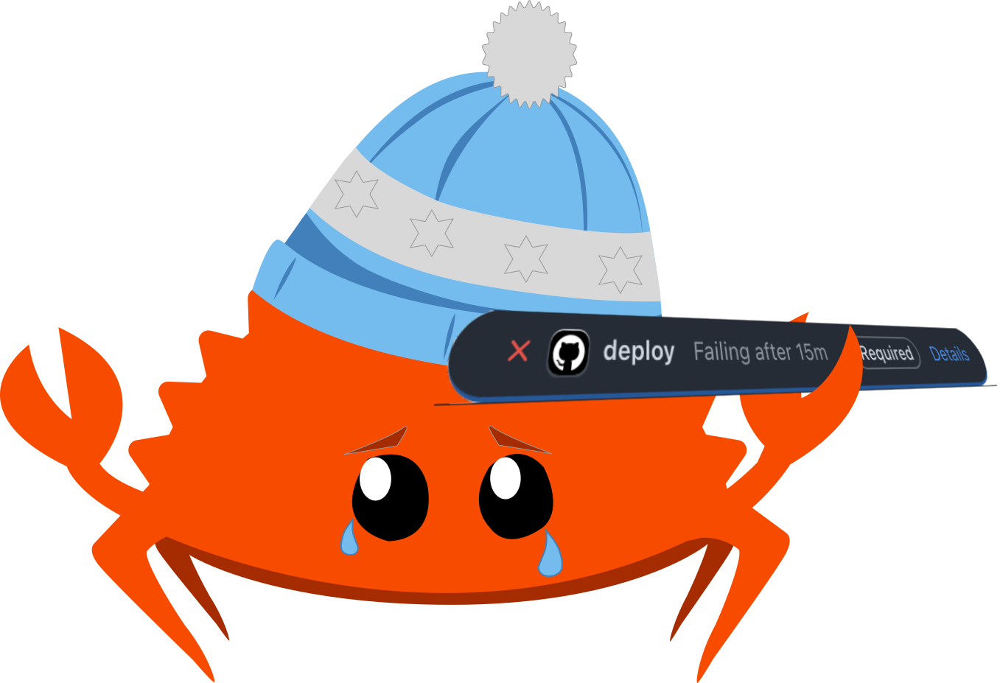

# Deploying Your Rust Code
Please, just work...



---

## What are we doing?

* Testing
* Linting
* Building
* Deploying

---
## How are we doing?

- bootstrapping
- task running
- caching
- alerting

---

## Testing

* `cargo test`
* Testing
* Building
* Deploying
---

## Linting

General/non-rust linting

* taplo (TOML)
* shellcheck (`bash`)
* hadolint (`Dockerfile`)
* typos
* ast-grep


---

## Bash can be...

- good!?
- [readable](https://explainshell.com/explain?cmd=sudo+ln+-sf+%22%241%22+%22%242%22)
- maintainable
- reliable
- not `python` or `node`!

---

## Get our task runner

github.com/mkatychev/rust-...

```bash
_just() {
  local version="1.36.0"
  curl --proto '=https' --tlsv1.2 -sSf https://just.systems/install.sh | bash -s -- --tag $version --to "$HOME"/.cargo/bin
}
```


---

## [Just](https://just.systems/) is...
- not `python`, `make`, or `cargo-make`!

```justfile
a-task-runner:
  echo 'This is not meant to be used as a compilation tool!'

# this is a comment
another-recipe:
  @echo 'This is another recipe.'
```

---

# CI: time is money friend!

CI has 2 basic axes: time and money

- time spent in CI
- CI runner beefiness

---

# Considerations

- is your CI runner self hosted?
- where is the best place to put the most horsepower
- is automating this really worth it???


<!---->
<!-- <iframe src="https://github.com/hahnec/marp-recipes/blob/master/compile.sh#L3-L11" class="h-full"></iframe> -->

<iframe frameborder="0" scrolling="no" style="width:100%; height:363px;" allow="clipboard-write" src="https://emgithub.com/iframe.html?target=https%3A%2F%2Fgithub.com%2Fhahnec%2Fmarp-recipes%2Fblob%2Fmaster%2Fcompile.sh%23L3-L11&style=default&type=markdown&showBorder=on&showLineNumbers=on&showFileMeta=on&showFullPath=on&showCopy=on"></iframe>

---

## Error:


https://github.com/mkatychev/rust_errors/blob//.github/workflows/test.yaml#L27-L29

tl;dr: an error in Rust is something emitted by a `Result::Err` enum or the `panic!` macro


## `panic!`

```rust
panic!("This is not an error!");
```
 > The Rust language provides two complementary systems for handling errors: `panic!` and `Result`.
> The `panic!` macro is used to construct errors that represent a bug that has been detected in your program.
> `Result` is used alongside user defined types which represent the various anticipated runtime failure modes that the associated computation could encounter.

---

## `Result::Err` and `std::error::Error`


---

`Result::Err` is quite similar to `Option`:

```rust
//       keyword
//       |      Type of returned value that will be
//       |      | held by `Some(T)`
//       v      v
pub enum Option<T> { // < Body of enum option,
    None,            // | When Option is unwrapped:
    Some(T),         // | it will be either `None`
}                    // < or `Some(T)`
```

---

the `T` is now accompanied by an `E`:

```rust
//       keyword
//       |      `Ok(T)`
//       |      | `Err(E)`
//       v      v  v
pub enum Result<T, E> {
    Ok(T),
    Err(E),
}
```

* the three following examples will be dealing with the inner `E` of a `Result<T, E>`

---

## `dyn Error`

the `std::error::Error` Trait

```rust
pub trait Error: Debug + Display {
    // Provided methods
    fn source(&self) -> Option<&(dyn Error + 'static)> { ... }
    // these two are deprecated
    fn description(&self) -> &str { ... }
    fn cause(&self) -> Option<&dyn Error> { ... }
    // this one is nightly only
    fn provide<'a>(&'a self, request: &mut Request<'a>) { ... }
}
```

---

## `dyn Error`

```rust
fn main() -> Result<(), Box<dyn std::error::Error>> {
    Err("throw this str into a box!".into())
}
```

---

<iframe src="https://docs.rs/anyhow/latest/anyhow/struct.Error.html" class="h-full"></iframe>

---

## type erasure

```rust
// anyhow::Error
pub struct Error {
    inner: Own<ErrorImpl>,
}

impl<E> ErrorImpl<E> {
    fn erase(&self) -> Ref<ErrorImpl> {
        // Erase the concrete type of E but preserve the vtable in self.vtable
        // for manipulating the resulting thin pointer. This is analogous to an
        // unsize coercion.
        Ref::new(self).cast::<ErrorImpl>()
    }
}
```

---

## concrete types

```rust
use thiserror::Error;

#[derive(Error, Debug)]
pub enum DataStoreError {
    #[error("data store disconnected")]
    Disconnect(#[from] io::Error),
    #[error("the data for key `{0}` is not available")]
    Redaction(String),
    #[error("invalid header (expected {expected:?}, found {found:?})")]
    InvalidHeader {
        expected: String,
        found: String,
    },
    #[error("unknown data store error")]
    Unknown,
}

fn main() -> Result<(), DataStoreError> {
    Err(DataStoreError::Unknown)
}
```

---

To review:

* dynamic dispatch/opaque type:
  `dyn Error` (`std::error::Error`)
* `enum Error` concrete type (oftentimes an `enum`)
* `Erase::err(self).cast::<OwnedDataStructure>()` (type erasure/corecion)


---

## The `?` operator

https://doc.rust-lang.org/std/ops/trait.Try.html

---

<iframe src="https://google.github.io/comprehensive-rust/error-handling/try.html" class="h-full"></iframe>

---

## With `Option`

```rust
fn try_1() -> Option<usize> {
    let _ = Some(1)?;
    None
}

fn try_2() -> Option<usize> {
    let _ = None?;
    Some(1)
}
```

---

## `error-stack`

https://hash.dev/blog/announcing-error-stack

---

`error_stack::Report`:

```rust
pub struct Report<C> {
    // The vector is boxed as this implies a memory footprint equal to a single pointer size
    // instead of three pointer sizes. Even for small `Result::Ok` variants, the `Result` would
    // still have at least the size of `Report`, even at the happy path. It's unexpected, that
    // creating or traversing a report will happen in the hot path, so a double indirection is
    // a good trade-off.
    #[allow(clippy::box_collection)]
    pub(super) frames: Box<Vec<Frame>>,
    _context: PhantomData<fn() -> *const C>,
}
```

---

`error_stack::Context`:

```rust
pub trait Context: Display + Debug + Send + Sync + 'static {
    // Provided method
    fn provide<'a>(&'a self, request: &mut Request<'a>) { ... }
}
```

---

```rust
impl<C> Report<C> {
    pub fn change_context<T>(mut self, context: T) -> Report<T>
    where
        T: Context,
    {
        let old_frames = mem::replace(self.frames.as_mut(), Vec::with_capacity(1));
        let context_frame = vec![Frame::from_context(context, old_frames.into_boxed_slice())];
        self.frames.push(Frame::from_attachment(
            *Location::caller(),
            context_frame.into_boxed_slice(),
        ));
        Report {
            frames: self.frames,
            _context: PhantomData,
        }
    }
}
```

* `Frame`s?
* `Location`?

---

<iframe src="https://docs.rs/error-stack/latest/error_stack/iter/struct.Frames.html#example" class="h-full"></iframe>

---

<iframe src="https://doc.rust-lang.org/std/panic/struct.Location.html" class="h-full"></iframe>

---

`Location` and `#[track_caller]`:

<iframe src="https://doc.rust-lang.org/reference/attributes/codegen.html#the-track_caller-attribute" class="h-full"></iframe>

---

```rust
impl<T, C> ResultExt for core::result::Result<T, C>
where
    C: Context,
{
    type Context = C;
    type Ok = T;

    #[track_caller]
    fn attach<A>(self, attachment: A) -> Result<T, C>
    where
        A: Send + Sync + 'static,
    {
        match self {
            Ok(value) => Ok(value),
            Err(error) => Err(Report::new(error).attach(attachment)),
        }
    }
}
```

---

## `error-stack` and intent

<iframe src="https://docs.rs/error-stack/latest/error_stack/index.html#initializing-a-report" class="h-full"></iframe>

---

## `bigerror` motications

- `thiserror` enum trees
- `error-stack` verbosity
- trait speicialization
- nightly features


---

```rust
pub trait OptionReport<T>
where
    Self: Sized,
{
    fn expect_or(self) -> Result<T, Report<NotFound>>;
    fn expect_kv<K, V>(self, key: K, value: V) -> Result<T, Report<NotFound>>
    where
        K: Display,
        V: Display;
    fn expect_field(self, field: &'static str) -> Result<T, Report<NotFound>>;

    #[inline]
    #[track_caller]
    fn expect_kv_dbg<K, V>(self, key: K, value: V) -> Result<T, Report<NotFound>>
    where
        K: Display,
        V: Debug,
    {
        self.expect_kv(key, Dbg(value))
    }

    #[inline]
    #[track_caller]
    fn expect_by<K: Display>(self, key: K) -> Result<T, Report<NotFound>> {
        self.expect_kv(Index(key), ty!(T))
    }
}
```

---

```rust
pub trait EnsureCount<T>
where
    Self: Sized,
{
    fn len(&self) -> usize;
    fn is_empty(&self) -> bool {
        self.len() == 0
    }
    // first (and hopefully only) unordered element
    fn into_only(self) -> Option<T>;
    // ensures a collection has only one element
    fn only_one(self) -> Result<T, Report<AssertionError>> {
        ensure!(self.len() == 1, self.err("expected exactly one element"));
        Ok(self.into_only().unwrap())
    }
    // ensures a collection has one or zero elements
    fn one_or_none(self) -> Result<Option<T>, Report<AssertionError>> {
        ensure!(
            self.len() == 1 || self.is_empty(),
            self.err("expected one or zero elements")
        );
        Ok(self.into_only())
    }
    fn one_or_more(&self) -> Result<(), Report<AssertionError>> {
        ensure!(!self.is_empty(), self.err("expected one or more elements"));
        Ok(())
    }
    fn err(&self, msg: &'static str) -> Report<AssertionError> {
        AssertionError::with_kv(ty!(Self), msg).attach_kv("len", self.len())
    }
}
```

---

https://github.com/dtolnay/case-studies/tree/master/autoref-specialization

---

## `bigerror` future considerations

- `_lazy` variant coverage
- errors that are not `Send + Sync`
- colour formatting
